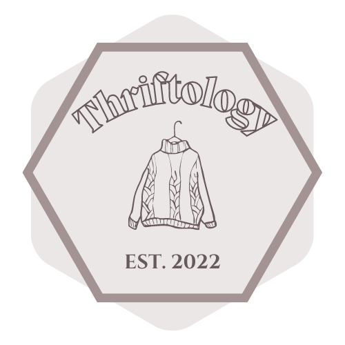
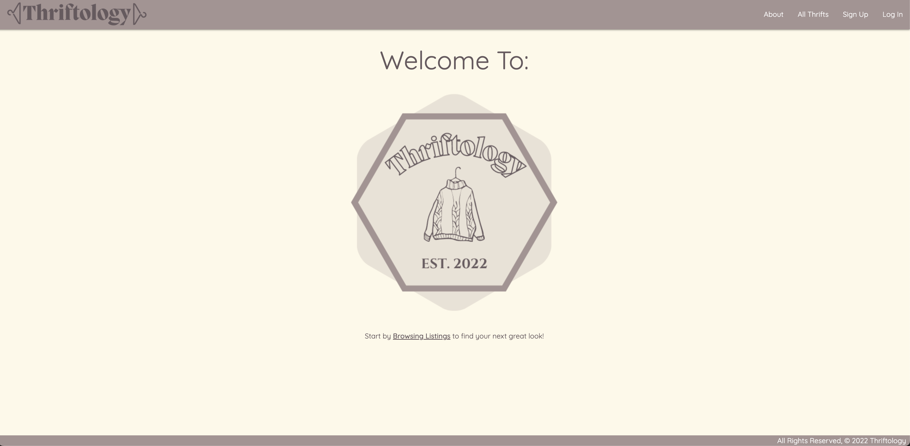
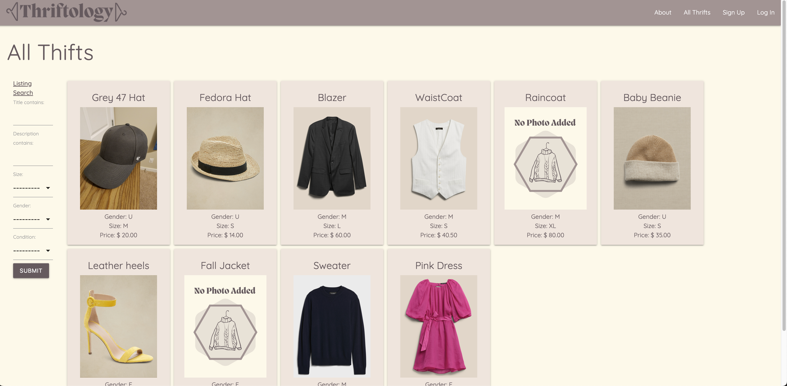
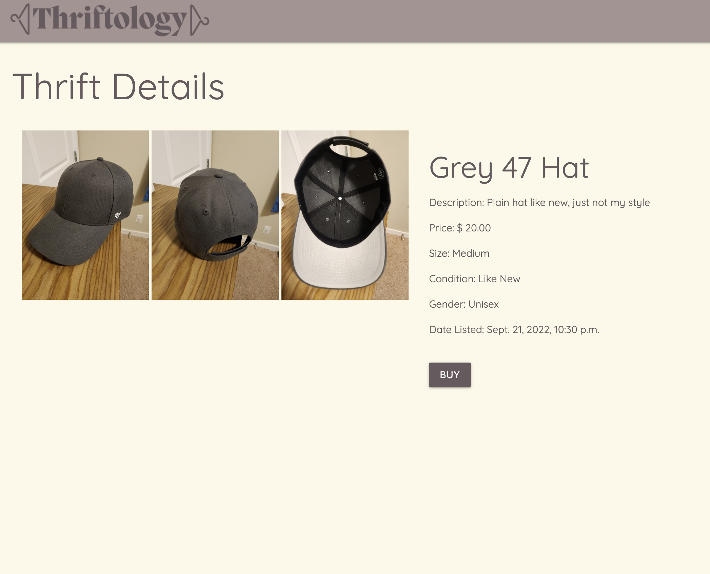
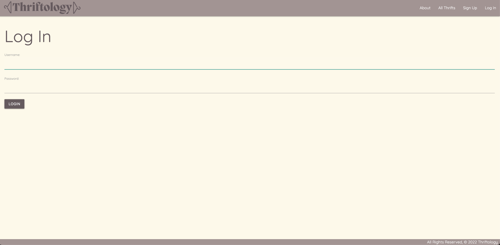
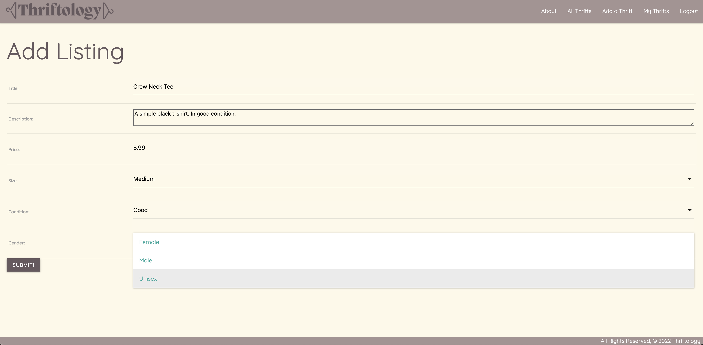
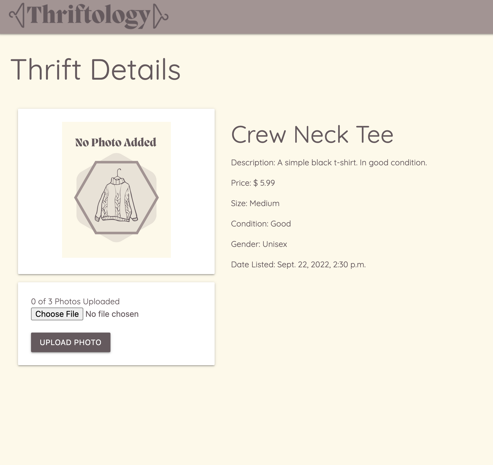
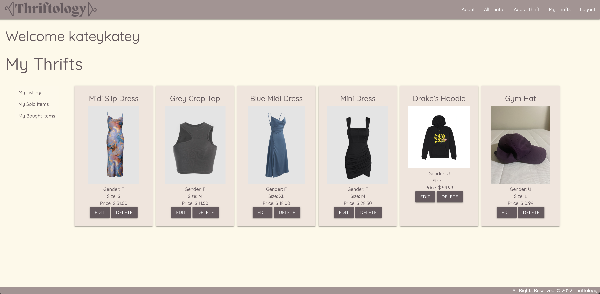
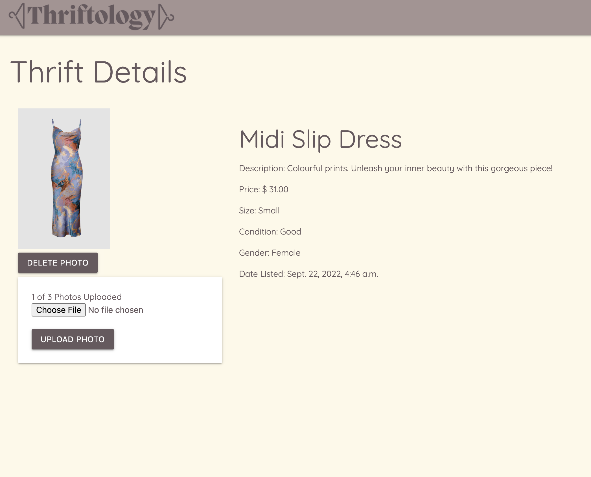

</img>

</img>

# Thriftology

*Thriftology* is a **community-based, used clothing web application** that brings you quality at an affordable price. As a user, you are able to both *buy* and *sell* thrifts. The name Thriftology comes from the word "thrift" which is defined as a non-wasteful way to manage financial wants and needs.

</img>

---

## How it Works:

At first glance, the user is able to either **sign up, log in, or navigate** to the "All Thrifts" page. Here, the user can view **all** listings:

</img>

When attempting to **buy** a listing, the user will be prompted to **log in**.

</img>

</img>

When logged in, the user can choose to **add a new thrift** as shown below. After clicking the "Submit!" button, the page renders the **details** page, where the user can upload photos of the item (up to 3 at a time):

</img>

</img>

After uploading a photo(s), the user is able to view *their* **listed, sold, and bought thrifts**. The user is also able to make **edits** to each listed thrift when necessary (ie. change description, upload a new photo, etc.), or **delete** a listed thrift.

</img>

</img>

## Technologies Used:

- PostgreSQL
- Django
- Python
- JavaScript
- HTML
- CSS
- Materialize
- Amazon Web Services (AWS)
- Heroku (Deployment)

## Getting Started:

Click here to render the app on **Heroku**:

https://thriftologysei.herokuapp.com/

Project Planning:

**Trello board**: https://trello.com/b/nGhM9m9n/clothing-sales-rentals

**ERD & Wireframe via Lucidchart**: https://lucid.app/lucidchart/611d9b07-5fe7-4895-9dfe-a60d1ceaaad0/edit?viewport_loc=-748%2C-107%2C3552%2C1721%2C0_0&invitationId=inv_37a5ec04-4071-43d6-8560-deaf115b0467#

## Next Steps - Planned Future Enhancements:

For the future, we will incorporate more features (listed below) to really provide a well rounded experience for all users.

**Ice Box Items**:

*A rental option for each listing* *User reviews for each listing* *Payment (online POS)* *Mobile-friendly view*

  
Creators: the **Code-Blooded Crew**

